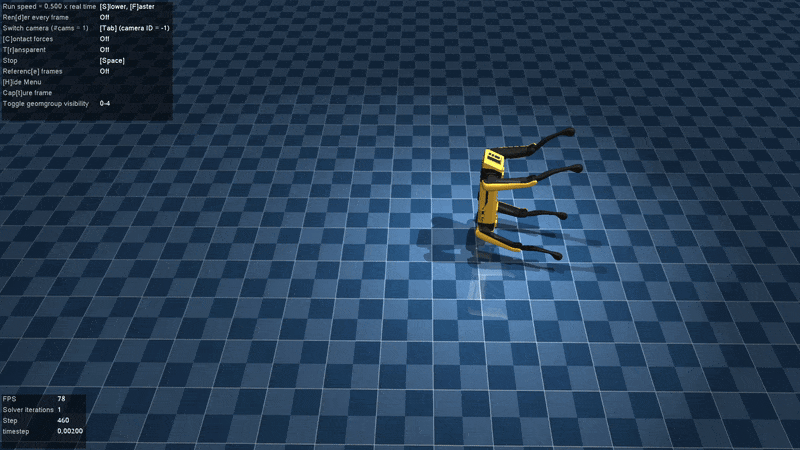
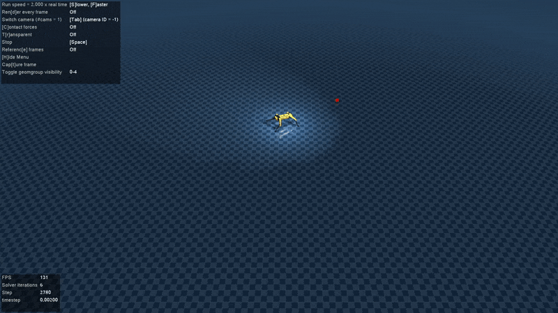

# DRLControl

Applying Deep Reinforcement Learning to control physically-based models.

This repository contains:
- Custom gymnasium environments
- Implementations of RL agents to solve these environments

## Environments

These custom environments are mostly built using [Gymnasium](https://gymnasium.farama.org/) and [Mujoco](https://mujoco.readthedocs.io/). They are typically more complicated than the ones provided by Gymnasium. They are designed to be more challenging and to require more complex control strategies. Feel free to use them to test your own implementations of RL agents.

All custom environments are registered in the `gymnasium` registry, so you can create them using `gym.make()`. They inherit the `MujocoEnv` base class provided by Gymnasium, which allows you to use the standard methods and attributes of a Mujoco environment, and therefore can also be used with custom parameters supported by `MujocoEnv`.

To use these environments, you will need the following dependencies:
- [Gymnasium](https://gymnasium.farama.org/)
- [Mujoco](https://mujoco.readthedocs.io/)
- [Numpy](https://numpy.org/)

And if you want to use the provided test PPO agent, you will also need:
- [PyTorch](https://pytorch.org/)
- [PyQtGraph](https://pyqtgraph.readthedocs.io/en/latest/)

You can refer to [ppo.py](src/ppo.py) for an example of how to use an RL agent to train on these environments. If you have all the dependencies installed, you can run the provided test PPO agent on the environments using the following command:

```bash
python src/ppo.py 
```

Here are some of the custom environments included in this repository.

### ViperX - Robot Arm Manipulation


This environment aims to move the robot arm to grab the box and place it in the target location. It uses the ViperX 300 6DOF robot arm model from Trossen Robotics, provided from the [mujoco-menagerie](https://github.com/google-deepmind/mujoco_menagerie/tree/main/trossen_vx300s) repository. Details for the full parameter list can be found at [viperx.py](src/envs/viperx.py).

```python
import gymnasium as gym
import envs # The module path containing the src/envs directory in this repository

models_path = "models" # Should be your absolute path to the models directory

env = gym.make(
    "ViperX-v0",
    render_mode="human",
    frame_skip=5,
    max_episode_steps=20000,  # physics steps will have been multiplied by 5, due to the frame_skip value
)
```

### Spot / Anymal - Quadrupedal Robot Manipulation

This environment simulates a simple quadruped robot walking towards a target location. You can either use the Spot quadruped robot model from Boston Dynamics, or the Anymal B quadruped robot model from Anybotics, both provided from the [mujoco-menagerie](https://github.com/google-deepmind/mujoco_menagerie/tree/main/boston_dynamics_spot) repository. Details for the full parameter list can be found at the following files:

- Forward Locomotion: [forward.py](src/envs/legged/forward.py)


> Caution! A commonly achieved gait is the quadruped robot performing a series of backflips for forward locomotion, learned from a set of sub-optimal environment parameters 😅. Try to train the robot for walking / running instead for more stable performance.

- Targeted Locomotion: [target.py](src/envs/legged/target.py)



- Targeted Locomotion with non-uniform terrain: [terrain.py](src/envs/legged/terrain.py)


Ideally, these environments provide a set of observation / reward functions that you can use to train a quadruped robot to achieve the environment's goals. It is best to use the environment wiht your own custom scene files for environments like `terrain.py` to generate your own custom terrain. The example scene files are listed below for reference.

```python
import gymnasium as gym
import envs # The module path containing the src/envs directory in this repository

models_path = "models" # Should be your absolute path to the models directory

env = gym.make(
    "LeggedForwardEnv",
    render_mode="human",
    frame_skip=5,
    max_episode_steps=20000,  # physics steps will have been multiplied by 5, due to the frame_skip value
    xml_file=os.path.join(models_path, "boston_dynamics_spot/scene_gap.xml"), # Forward locomotion with gaps
)

env = gym.make(
    "LeggedTargetEnv",
    render_mode="human",
    frame_skip=5,
    max_episode_steps=20000,  # physics steps will have been multiplied by 5, due to the frame_skip value
    xml_file=os.path.join(models_path, "anybotics_anymal_b/target.xml"), 
)

env = gym.make(
    "LeggedTerrainEnv",
    render_mode="human",
    frame_skip=5,
    max_episode_steps=20000,  # physics steps will have been multiplied by 5, due to the frame_skip value
    xml_file=os.path.join(models_path, "anybotics_anymal_b/scene_terrain.xml"), # Bumpy terrain generated with perlin noise
)
```

### Cassie - Bipedal Robot Forward Locomotion

This environment simulates a simple bipedal robot walking forward. It uses the Cassie bipedal robot model from Agility Robotics, provided from the [mujoco-menagerie](https://github.com/google-deepmind/mujoco_menagerie/tree/main/agility_cassie) repository.

```python
import gymnasium as gym
import envs # The module path containing the src/envs directory in this repository

models_path = "models" # Should be your absolute path to the models directory

env = gym.make(
    "Cassie-v0",
    render_mode="human",
    frame_skip=5,
    max_episode_steps=20000,  # physics steps will have been multiplied by 5, due to the frame_skip value
    xml_file=os.path.join(models_path, "agility_cassie/scene.xml"), # Forward locomotion
)
```